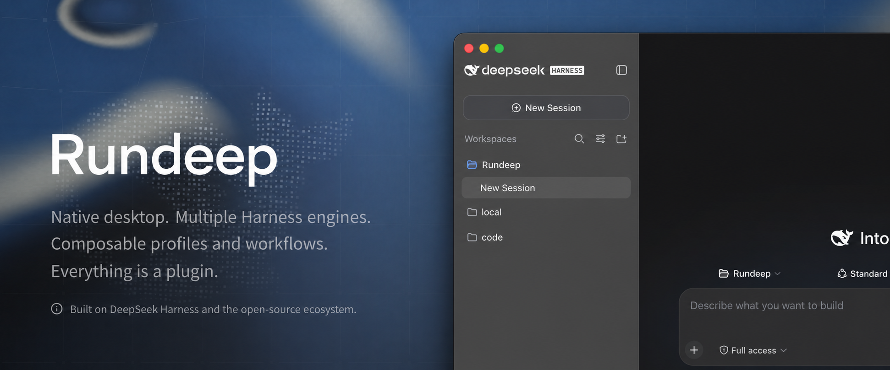
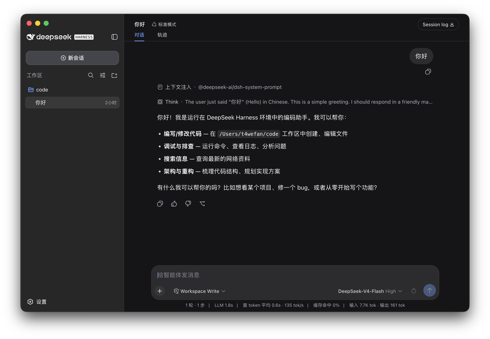
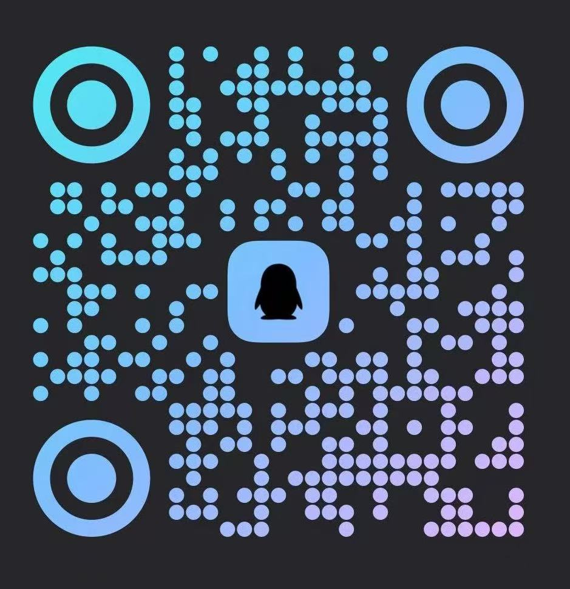

<h1 align="center">Rundeep</h1>

<p align="center">
  <strong>An open-source desktop agent workspace for Windows and macOS.</strong><br>
  Multiple Harness engines, native desktop workflows, a plugin market, and composable automation.<br>
  Everything is a plugin — the desktop itself is a plugin.
</p>

<p align="center"><sub>Rundeep is independently developed by its community and built on DeepSeek Harness and the open-source ecosystem.<br><a href="README.md">中文</a> · English</sub></p>

<p align="center">
  
</p>

<p align="center">
  <a href="https://github.com/RichGua/Rundeep/releases/latest"></a>
  <a href="https://github.com/RichGua/Rundeep/releases"></a>
  <a href="https://github.com/RichGua/Rundeep"></a>
  <a href="LICENSE"></a>
  <a href="https://discord.gg/TJeGqKRNM"></a>
  
</p>

<p align="center">
  
</p>

Rundeep brings a composable agent runtime to the native desktop: switch between DeepSeek Harness and Codex Harness, manage workspaces and sessions, use native windows, tray, and terminals, and work with profiles, recovery, updates, and a built-in plugin market. It runs a pinned [DeepSeek Harness](https://github.com/deepseek-ai/deepseek-harness) checkout unchanged as its agent and plugin foundation, then uses Electron, Cordis, React, TypeScript, and the OpenAI Codex SDK for Rundeep's desktop and multi-engine capabilities.

<a id="run"></a>

## Download and install

Current release installers support Windows x64 and macOS Universal. No extra environment is needed — download, install, and start using it with one click.

| Platform | Download | Installation |
| --- | --- | --- |
| Windows x64 | [Download installer](https://www.dshdesktop.cn/api/downloads/windows) | Run the NSIS installer and follow its prompts |
| macOS Universal | [Download DMG](https://www.dshdesktop.cn/api/downloads/mac) | Open the DMG and drag Rundeep into Applications |

See the [user guide](docs/user-guide.en.md) and [FAQ](docs/faq.en.md) for plugin commands, platform details, and troubleshooting.

Together with every plugin author, we want to build an open, composable, and sustainable DSH plugin ecosystem where plugins grow alongside each other. Read the [DSH plugin ecosystem manifesto](docs/plugin-ecosystem.en.md).

## Documentation

Ordinary users can start with the [user guide](docs/user-guide.en.md); the developer documentation is only needed when extending or maintaining the application.

### User documentation

| Goal | Entry point |
| --- | --- |
| Install and use the application | [User guide](docs/user-guide.en.md) |
| Check platforms, prerequisites, and product boundaries | [FAQ](docs/faq.en.md) |
| Understand why the project exists | [Why Rundeep](docs/why-desktop.en.md) |
| See the full documentation and README map | [Documentation index](docs/README.en.md) |

### Developer and maintainer documentation

| Goal | Entry point |
| --- | --- |
| Read the plugin ecosystem manifesto | [Plugin ecosystem manifesto](docs/plugin-ecosystem.en.md) |
| Build ordinary or Desktop plugins | [Plugin development](docs/plugin-development.en.md) |
| Join the unified plugin-contract discussion | [DSH Community Fabric Draft](dsh-community-fabric/README.md) |
| See the research behind the unified plugin framework | [Framework and real-plugin research](dsh-community-fabric/docs/research/mature-plugin-frameworks.md) |
| Read the plugin market product and safety design | [DSH Community Market](dsh-community-market/README.md) |
| See what Desktop plugins can use | [Desktop plugin API](dsh-plugin-desktop/docs/plugin-services.md) |
| Understand how the desktop works | [Architecture](docs/architecture.en.md) |
| Read package-level build and release details | [`dsh-plugin-desktop/README.md`](dsh-plugin-desktop/README.md) |

## Features

<table>
  <tr>
    <td width="50%" valign="top">
      <h3>Desktop</h3>
      <p>Bring the upstream DeepSeek Harness local Web UI to a native desktop application. The app starts and manages the local Harness service, integrates the system tray and desktop window, and requires no Node.js installation or command-line setup.</p>
    </td>
    <td width="50%" valign="top">
      <h3>Mobile Remote Control </h3>
      <p>Connect to Desktop from iOS and Android to start tasks, monitor Agent progress, and send follow-ups from your phone.</p>
    </td>
  </tr>
  <tr>
    <td width="50%" valign="top">
      <h3><a href="dsh-community-market/README.md">Plugin Marketplace</a> </h3>
      <p>DSH Community Market is complete and built in, with plugin discovery, details, installation, and management. The market openly connects to a wide range of plugin data sources: anyone can provide, integrate, and use a source that follows the public schemas, while existing APIs can join as cooperating sources through a reviewed adapter.</p>
    </td>
    <td width="50%" valign="top">
      <h3>Co-build the Plugin Ecosystem</h3>
      <p>The DSH plugin ecosystem is built by the community. Upstream plugins, Rundeep plugins, and other community plugins follow shared conventions and can work together through the same composition mechanism. Join us — read the <a href="docs/plugin-ecosystem.en.md">DSH plugin ecosystem manifesto</a>.</p>
    </td>
  </tr>
</table>

## Plugin Ecosystem

Plugins are extensions that add capabilities to DSH — models, tools, interfaces, and workflows can all be plugins, combined like building blocks.

Rundeep does not modify upstream source, and it is not a fixed, hardcoded shell. A pinned upstream DeepSeek Harness version runs unchanged; the desktop shell itself — the window, tray, terminal, updates, and work profiles — integrates as a DSH plugin through the plugin mechanism provided by DeepSeek Harness. From the core agent to the desktop shell, the whole product follows the same "everything is a plugin" rule: plugins compatible with the pinned upstream version can be used, while desktop capabilities are composed, replaced, and evolved in the same way.

We want the plugin ecosystem to work like a phone app store: every plugin is built against the same set of rules, so plugins can be installed together and work together without interfering with each other.

### For developers

Unlike many other projects, this project itself is a DSH [plugin](docs/plugin-development.en.md): the desktop shell uses the same plugin composition mechanism as third-party plugins. Desktop plugin capabilities are now available. We provide Desktop services so plugin developers can integrate their plugins with desktop capabilities: for example, viewing and switching work profiles, or installing, updating, and removing plugins in the active profile. See the [Desktop plugin API](dsh-plugin-desktop/docs/plugin-services.md) for complete usage details. See [Why Rundeep](docs/why-desktop.en.md) and [Plugin development](docs/plugin-development.en.md) for the reasoning and the third-party boundary.

## Open-source foundation and the Rundeep experience

Rundeep builds on a mature open-source ecosystem: [DeepSeek Harness](https://github.com/deepseek-ai/deepseek-harness) provides the agent, model, tool, session, workflow, Web UI, and plugin foundation; [Cordis](https://github.com/cordiverse/cordis) provides composable services and plugins; Electron, React, and TypeScript power the native desktop and interface layers; and the OpenAI Codex SDK powers Rundeep's Codex Harness engine.

On that foundation, Rundeep focuses on its own product experience:

- One-click switching between DeepSeek Harness and Codex Harness, reusing endpoint and credential settings
- Native windows, tray, terminals, local-service lifecycle management, and cross-platform installers
- Composable profiles, startup and update recovery, diagnostic export, and safe rollback
- A built-in open plugin market and service APIs for desktop plugins
- A pinned, unmodified DeepSeek Harness checkout for plugin compatibility and predictable upgrades

Rundeep-owned code is licensed under the MIT License. Third-party components retain their respective copyrights and open-source licenses; see [THIRD_PARTY_NOTICES.md](dsh-plugin-desktop/THIRD_PARTY_NOTICES.md) for details.

<a id="run-from-source"></a>

## Development

Desktop source lives in `dsh-plugin-desktop/`. The outer repository uses Yarn, while the pinned `deepseek-harness/` submodule keeps its own pnpm workspace. From the repository root:

```sh
git submodule update --init --recursive
corepack yarn install --immutable
corepack yarn dev
```

Use `corepack yarn check` for the headless gate. The [architecture](docs/architecture.en.md) and package [`README`](dsh-plugin-desktop/README.md) describe the full build, test, and release boundaries. See [CONTRIBUTING.en.md](CONTRIBUTING.en.md) for how to contribute.

## Community

Choose whichever platform you prefer to discuss usage, plugin development, and project updates.

<table>
  <thead>
    <tr>
      <th align="center">WeCom</th>
      <th align="center">QQ Group</th>
    </tr>
  </thead>
  <tbody>
    <tr>
      <td align="center"></td>
      <td align="center"></td>
    </tr>
  </tbody>
</table>

Discord: [Join the Rundeep community](https://discord.gg/TJeGqKRNM)

If you would like to join our technical team, contact us at [t4wefan@qq.com](mailto:t4wefan@qq.com).

## Related Links

Ecosystem projects and developer tools around DeepSeek Harness.

| Project | About | Link |
| --- | --- | --- |
| dshfind | The learning & sharing community for DeepSeek Harness (DSH). | [GitHub](https://github.com/hikariming/dshfind) |
| DSH 1024Store | A community plugin directory for the DeepSeek Harness (DSH) ecosystem (4,120 plugins), open-sourcing an online marketplace, a collection pipeline, and a public query API — fork it to deploy your own marketplace. | [GitHub](https://github.com/imsai-sh/awesome-deepseek-harness-plugins) |
| Awesome DSH Plugin | Curated list of DeepSeek Harness (DSH) plugins. | [GitHub](https://github.com/awesome-dsh-plugin/awesome-dsh-plugin) |
| dsh-market | Visual plugin market for DeepSeek Harness, with browsing, search, and one-click installation. | [GitHub](https://github.com/dsh-market/dsh-market) |
| ModLens | Adds OCR, layout, and semantic vision capabilities to DeepSeek Harness and text-only coding agents. | [GitHub](https://github.com/liustack/modlens) · [Website](https://liustack.dev) |
| DeepSeek Harness Orange Book | Community field manual for DeepSeek Harness. | [GitHub](https://github.com/alchaincyf/deepseek-harness-orange-book) |
| dsh-web-ui | DeepSeek Harness Web UI plugins and themes. | [GitHub](https://github.com/zhu1090093659/dsh-web-ui) · [Gallery](https://gallery.dsh-market.com) |
| dsh-TUI | Full-screen interactive terminal interface for DeepSeek Harness. | [GitHub](https://github.com/ccch1mneyyy/dsh-TUI) |
| dsh-tianshu-tui | Minimalist interactive terminal UI plugin for the DSH web client with a self-developed ANSI rendering core for silky-smooth output; adds TDD, evidence gates, and vision/image module workflows on top of the official UI. | [GitHub](https://github.com/huiliyi37/dsh-tianshu-tui) |
| dsh-context | DSH context insight panel: Context dashboard + `/context` command + Context browser for one-stop context lifecycle management — category composition, content details, evolution trends, compaction/injection events, and statistics. | [GitHub](https://github.com/bowenliang123/dsh-context) · [NPM](https://www.npmjs.com/package/dsh-context) |
| Agents-Anywhere | Remote-control your desktop coding agent from your phone. | [GitHub](https://github.com/anywhere-labs/Agents-Anywhere) |
| deepseek-harness-remote | Remote control and multi-device collaboration plugin for DeepSeek Harness based on P2P and APIProxy. | [GitHub](https://github.com/liguobao/deepseek-harness-remote) |
| DSH-better-sidebar | Sidebar workbench for DeepSeek Harness with files, terminal, Git, and subagents. | [GitHub](https://github.com/omdsh-dev/DSH-better-sidebar) |
| Awesome DeepSeek Harness | Curated list of DeepSeek Harness plugins, tools, and infrastructure. | [GitHub](https://github.com/0xsline/awesome-deepseek-harness) · [Website](https://deepseekdocs.com/) |
| MkSaaS · TanStarter | Commercial SaaS starter templates for indie developers. MkSaaS is built on Next.js; TanStarter on TanStack Start and Cloudflare, with AI, auth, payments, and admin baked in. | [MkSaaS](https://mksaas.com) · [TanStarter](https://tanstarter.dev) |

<sub>To list your project, join the WeChat group and message @王博升Benson, or contact t4wefan@qq.com, or <a href="https://github.com/RichGua/Rundeep/issues">open an issue</a>.</sub>

## License

Rundeep-owned code is licensed under the [MIT License](LICENSE). Bundled third-party components retain their respective copyrights and licenses; see [THIRD_PARTY_NOTICES.md](dsh-plugin-desktop/THIRD_PARTY_NOTICES.md). Project names are used only to identify technical dependencies and compatibility.

## Star History

<a href="https://www.star-history.com/?repos=RichGua%2FRundeep&type=date&legend=top-left">
 <picture>
   <source media="(prefers-color-scheme: dark)" srcset="https://api.star-history.com/chart?repos=RichGua/Rundeep&type=date&theme=dark&legend=top-left" />
   <source media="(prefers-color-scheme: light)" srcset="https://api.star-history.com/chart?repos=RichGua/Rundeep&type=date&legend=top-left" />
   
 </picture>
</a>
